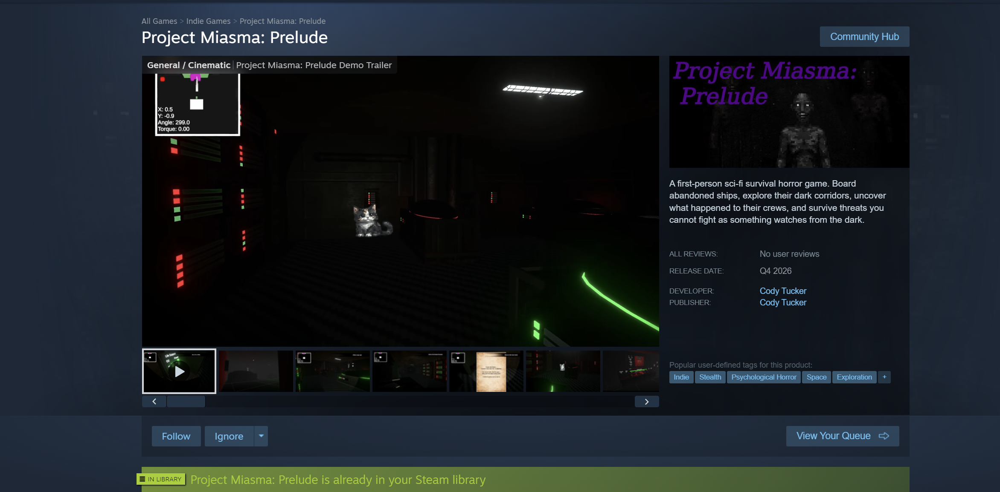
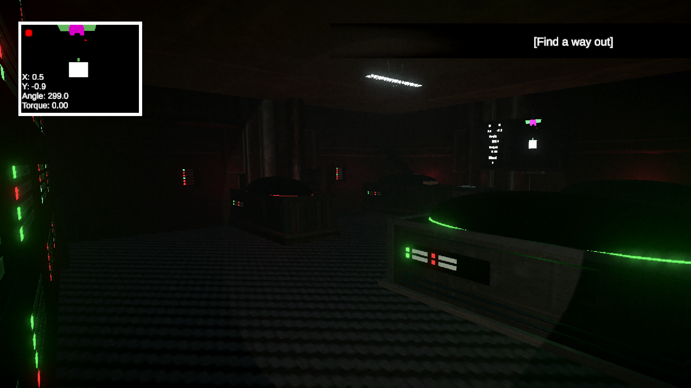
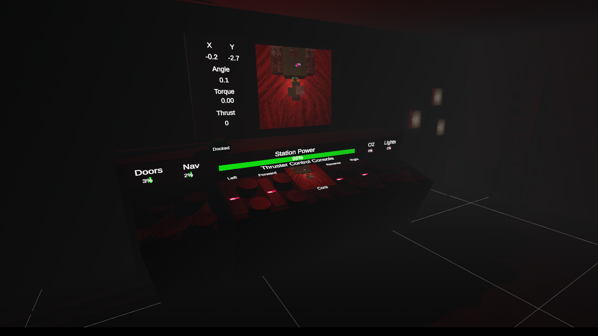
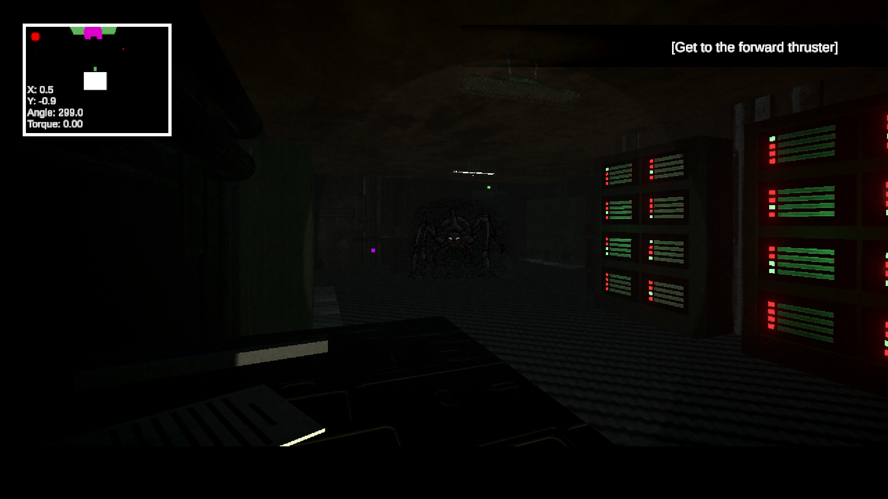

# Project Miasma: Prelude

### Independently designed, developed, and released sci-fi survival horror game

**Project Miasma: Prelude** is a first-person sci-fi survival horror game built independently in Unity and C#.

The released Steam demo is a complete ~30-minute vertical slice containing the major systems, progression, enemies, environments, narrative, UI, persistence, and release infrastructure of the larger project.

[▶ Play the free demo on Steam](https://store.steampowered.com/app/4802330/Project_Miasma_Prelude/)

## Project Overview

I built Project Miasma independently from concept through public Steam release.

My work included:

- Software architecture
- Gameplay programming
- Enemy AI
- Level design and implementation
- Power and oxygen systems
- Doors and environmental interactions
- Navigation systems
- UI
- Save/load and persistent state
- Progression and sequencing
- Narrative implementation
- Art and asset integration
- Audio and atmosphere integration
- Debugging and testing
- Build preparation
- Steam deployment and release

The project demonstrates the full delivery path:

**Concept → Architecture → Implementation → Integration → Debugging → Released Product**

## Technical Systems

### Ship Systems

The game contains interconnected ship infrastructure including:

- Electrical power
- Oxygen
- Lighting
- Navigation
- Doors
- Environmental systems
- Player progression

These systems affect one another rather than operating as isolated mechanics, helping the ship behave as a coherent environment.

### Enemy AI

Enemy behavior is divided into focused responsibilities such as:

- Sensors
- Movement
- Actions
- Behavior and planning
- Shared coordination
- Targeting
- Ownership and claims
- Failure handling
- Debug visibility

The architecture is designed to let enemies share common infrastructure while preserving enemy-specific behavior.

### Persistent State

The game distinguishes between:

- Static design data
- Durable runtime state
- Temporary enemy state
- Temporary coordination state
- Shared world state

Persistent systems are reconstructed after loading rather than blindly serializing every runtime object.

Stable IDs and explicit ownership rules are used to keep state consistent across scenes and save/load cycles.

## What This Project Demonstrates

- End-to-end product ownership
- Systems architecture
- Complex state management
- AI and behavior systems
- Cross-system integration
- Debugging and failure handling
- Independent technical execution
- Shipping software through Steam

## Technical Stack

- **Engine:** Unity
- **Language:** C#
- **Platform:** Windows / Steam
- **Version control:** Git / GitHub
- **Development:** Visual Studio
- **Additional tools:** Blender, Photoshop/GIMP, AI-assisted development tools

## Development Approach

My development style emphasizes modular architecture, explicit state and ownership, reusable systems, validation, failure handling, debug visibility, and iterative refactoring.

I use modern AI tools as an engineering accelerator for implementation, debugging, refactoring, and documentation while retaining responsibility for architecture, requirements, integration, validation, and product decisions.
